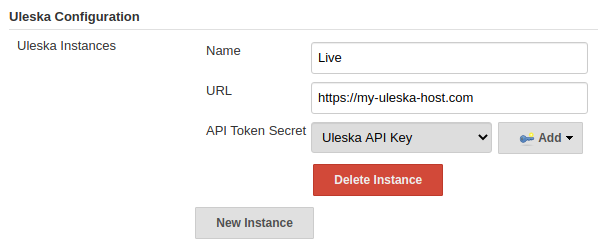
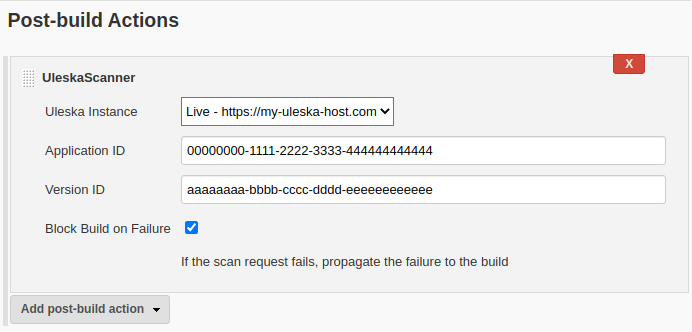

# Uleska for Jenkins

This plugin allows for easy integration with the 
[Uleska DevSecOps Platform](https://uleska.com), which automates and 
orchestrates software security testing within your DevOps pipeline.

The initial functionality is simply to kick off scans, therefore keeping your
vulnerability information up-to-date, but we plan to build on this in future
releases.

## Requirements

To use this plugin you will need a few things first:

 - A Uleska Platform account, [sign up here](https://www.uleska.com/)
 - An API key for your account, which you can request using the API/Swagger 
 when you are authenticated
 
## Getting Started

### 1. Adding a Connection

Navigate to your Jenkins Global Configuration (Home > Manage Jenkins > 
Configure System)

Scroll down to **Uleska Configuration** and click New Instance and insert the 
required data (all fields are required)



 - **Name:** Any descriptive name of your instance, e.g. Live
 - **URL:** The base URL of your instance, must contain schema and not contain any 
 path
 - **API Token Secret:** Platform API token stored in a Secret Text credential in 
 the Jenkins credential store

### 2. Adding a Scan Build Step

The plugin can be run in two ways:
 - Post-build Action in a Freestyle project
 - Step in a Pipeline project
 
Each takes in the same fields:
 - **Uleska Instance:** As configured in Global Config, select from dropdown or 
 insert Name as string
 - **Application ID:** UUID of the application to scan a version of
 - **Version ID:** UUID of the version to scan
 - **Toolkit Name** The name of the toolkit to run eg: `Uleska Code Scan`
 - **Block Build on Failure:** Whether to propagate the failure of the scan 
 request to the build
 
#### 2.1. Post Build Action

Scroll down to Post-build Actions and select **UleskaScanner** from **the Add 
post-build action** dropdown



#### 2.2. Pipeline Step

Add the following: to your pipeline.

```groovy
step([
    $class: 'UleskaScanner', 
    uleskaInstanceName: 'Live', 
    applicationId: '00000000-1111-2222-3333-444444444444', 
    versionId: 'aaaaaaaa-bbbb-cccc-dddd-eeeeeeeeeeee',
    toolkitName: 'Uleska Code Scan',    
    propagateFailure: true
])
```

Note you can also use Jenkins' Pipeline Syntax utility to generate the above 
snippet using a build step like form.

